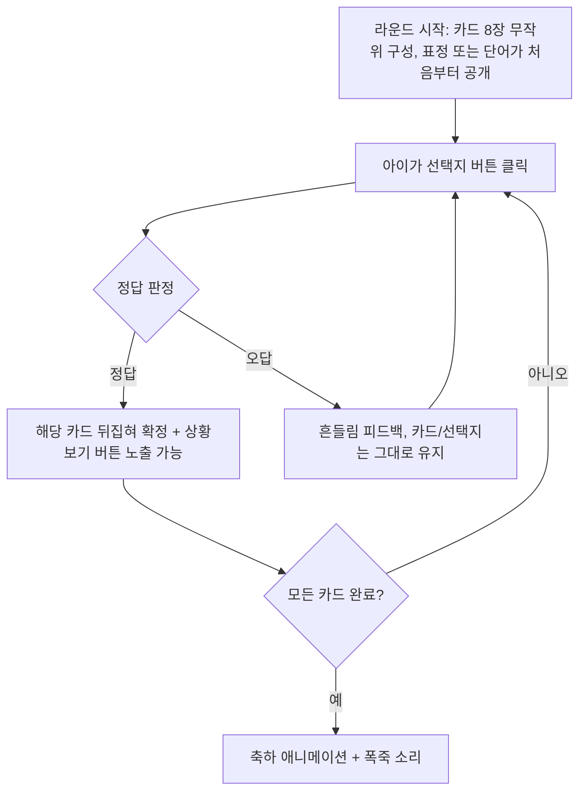
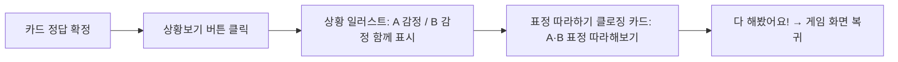
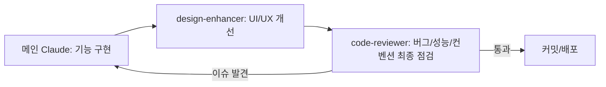

# PRD: 표정 맞추기 게임 (Emotion Match) — 5~7세 대상

- 문서 버전: v0.3
- 작성일: 2026-09-03
- 작성자: NS (Buildersncompany) / Claude 초안
- 구현 도구: Claude Code (서브에이전트 2종 운용 예정)
- 변경 이력:
  - v0.1 → v0.2: 감정 30여 개로 확장(무작위 출제 + 감정도감), 카드 인터랙션 구조 확정(표정 선공개형), 오답노트/초기화 버튼 추가, 상황 설명 카드 + 표정 따라하기 클로징 카드 추가
  - v0.2 → v0.3: 감정 목록을 사용자 확정본(31개, 심심하다·서운하다 추가, 중복되었던 "궁금하다" 정리)으로 교체, 라운드당 카드 수 8장 확정 + 예시 라운드 반영, 실사 표정 이미지 소싱 방식 확정(사용자 직접 수집 + Claude 보완), 완료 축하 사운드를 폭죽 소리로 확정, 오답노트는 틀린 횟수 없이 감정 목록만 표시하는 것으로 확정

---

## 1. 한 줄 요약

5~7세 아이(한글 읽기/쓰기 가능)가 다양한 감정 단어와 표정을 양방향으로 매칭해보는 웹 게임. 오답은 부담 없이 재시도하고, 정답을 맞히면 그 감정이 나오는 실제 상황(관점이 다른 두 인물의 감정 차이)까지 살펴보며, 마지막엔 직접 표정을 따라해보는 활동으로 마무리한다. 브라우저 기록 초기화만으로 다른 아이도 이어서 플레이할 수 있다.

---

## 2. 목표

- 5~7세 아이가 다양한 감정 어휘(31개)와 표정을 스스로 연결지으며 정서 어휘를 넓히도록 돕는다.
- 같은 상황에서도 사람마다 다르게 느낄 수 있다는 것(관점 차이/공감)을 자연스럽게 접하게 한다.
- 실패해도 벌칙이 없는 "안전한 반복 학습" 경험을 제공한다.
- 한 기기를 여러 아이가 돌아가며 사용할 수 있도록, 기록을 가볍게 초기화할 수 있게 한다.

### 타겟 사용자
- 만 5~7세 아동, 한글 읽기·쓰기 가능
- 플랫폼: 웹 브라우저 (PC/태블릿 우선, 모바일 터치 대응)

---

## 3. 게임 컨셉 & 핵심 플레이 흐름

라운드마다 전체 감정 풀(31개, 4장 참고)에서 **무작위로 8장(확정)** 을 뽑아 카드 그리드를 구성한다. 감정 계열별로 묶지 않고 완전 무작위로 섞는다.

### 3.1 모드 A — 표정 먼저 보고 감정 단어 맞히기
1. 라운드 시작 시 카드 그리드에 표정(일러스트/AI 그림) 카드들이 **처음부터 공개된 상태**로 나타난다 (뒷면으로 숨기지 않음).
2. 하단에는 이번 라운드에 해당하는 감정 단어 버튼들이 무작위 순서로 나열된다.
3. 아이가 감정 단어 버튼을 누르면, 그 단어와 실제로 짝이 맞는 카드가 **뒤집히며 단어 라벨이 확정 표시**된다 (정답 처리, 카드 고정).
4. 짝이 틀리면 → 부드러운 흔들림 피드백 후 그대로 유지, **몇 번이든 재시도 가능**.
5. 정답으로 확정된 카드에는 "상황보기" 버튼이 추가로 나타난다 (해당 감정에 상황 카드가 준비된 경우, 6장 참고).

### 3.2 모드 B — 감정 단어 먼저 보고 표정 찾기 (반대)
1. 라운드 시작 시 카드 그리드에 **감정 단어 카드들**이 처음부터 공개된 상태로 나타난다.
2. 하단에는 표정(일러스트/AI 그림) 선택지들이 무작위 순서로 나열된다.
3. 아이가 표정 선택지를 누르면, 그 표정과 짝이 맞는 단어 카드가 뒤집히며 **표정 그림이 확정 표시**된다 (정답 처리, 카드 고정). 오답 처리/재시도 규칙은 모드 A와 동일.

> 두 모드 모두 "카드(공개된 정답 대상) ↔ 선택지 버튼" 구조는 동일하고, 카드에 무엇을 먼저 보여주느냐만 반대입니다. 구현 시 하나의 상태 머신으로 통합 가능합니다.

### 3.3 완료 조건
- 라운드 내 모든 카드가 정답으로 고정되면 → 승리 연출(색종이/반짝임) + **폭죽 소리** 재생.



---

## 4. 감정 풀 — 31개 (무작위 출제 + 감정도감)

### 4.1 출제 방식
- 감정 계열(기쁨/슬픔/화남 등)로 묶어서 단계별로 제공하지 않고, **전체 풀에서 완전 무작위로 라운드를 구성**한다.
- 별도로 **"감정도감"** 메뉴를 만들어, 게임과 상관없이 전체 31개 감정을 그룹 없이 한 번에 훑어볼 수 있게 한다 (각 감정의 표정 그림 + 쉬운 설명 열람).

### 4.2 감정 확정 목록 (31개)

사용자 확정 30개 목록에 "심심하다", "서운하다"를 추가했습니다(원 목록에 중복 기재되었던 "궁금하다"는 1개로 정리). 쉬운 설명·예시 상황은 Claude가 초안으로 채운 것이므로 문구는 자유롭게 수정하셔도 됩니다.

| # | 감정 단어 | 쉬운 설명 | 예시 상황 |
|---|---|---|---|
| 1 | 감격하다 | 너무 좋아서 눈물이 날 것 같은 마음 | 오래 연습한 걸 성공했을 때 |
| 2 | 걱정하다 | 안 좋은 일이 생길까 봐 불안한 마음 | 엄마가 늦게 올 때 |
| 3 | 괜찮다 | 나쁘지 않고 편안한 마음 | 넘어졌지만 아프지 않을 때 |
| 4 | 궁금하다 | 알고 싶어서 두근거리는 마음 | 선물 상자 안이 궁금할 때 |
| 5 | 다행스럽다 | 나쁜 일이 안 생겨서 마음이 놓이는 느낌 | 잃어버린 물건을 찾았을 때 |
| 6 | 두렵다 | 무서워서 피하고 싶은 마음 | 높은 곳에 올라갔을 때 |
| 7 | 따분하다 | 재미없고 지루한 마음 | 똑같은 놀이를 계속할 때 |
| 8 | 미안하다 | 잘못해서 마음이 무거운 느낌 | 친구를 실수로 밀쳤을 때 |
| 9 | 부끄럽다 | 얼굴이 빨개지고 숨고 싶은 마음 | 사람들 앞에서 실수했을 때 |
| 10 | 불쌍하다 | 안됐고 마음이 아픈 느낌 | 다친 강아지를 봤을 때 |
| 11 | 뿌듯하다 | 내가 해냈다는 게 자랑스러운 마음 | 혼자 신발끈을 처음 묶었을 때 |
| 12 | 서럽다 | 억울하고 슬퍼서 눈물이 나는 마음 | 나만 빼고 놀러 갔을 때 |
| 13 | 안타깝다 | 마음이 아프고 아쉬운 느낌 | 친구가 넘어지는 걸 봤을 때 |
| 14 | 유쾌하다 | 기분 좋고 즐거운 마음 | 친구들과 신나게 웃을 때 |
| 15 | 창피하다 | 남들 앞에서 부끄러운 마음 | 옷에 음식을 흘렸을 때 |
| 16 | 초조하다 | 조마조마하고 불안한 마음 | 시험 결과를 기다릴 때 |
| 17 | 편안하다 | 마음이 느긋하고 좋은 상태 | 포근한 이불 속에 있을 때 |
| 18 | 놀라다 | "어?!" 하고 깜짝하는 마음 | 갑자기 큰 소리가 났을 때 |
| 19 | 무섭다 | 심장이 콩닥콩닥 떨리는 마음 | 어두운 방에 혼자 있을 때 |
| 20 | 억울하다 | 내 잘못이 아닌데 혼났을 때 드는 마음 | 친구가 잘못했는데 나만 혼났을 때 |
| 21 | 짜증나다 | 자꾸 신경 쓰이고 귀찮은 마음 | 하던 놀이를 자꾸 방해받을 때 |
| 22 | 실망하다 | 기대한 것과 달라서 속상한 마음 | 놀이공원이 문을 닫았을 때 |
| 23 | 좋아하다 | 마음이 끌리고 기분 좋은 느낌 | 좋아하는 친구를 만났을 때 |
| 24 | 부럽다 | 남이 가진 걸 나도 갖고 싶은 마음 | 친구의 새 장난감을 봤을 때 |
| 25 | 피곤하다 | 힘이 다 빠진 느낌 | 하루 종일 뛰어놀았을 때 |
| 26 | 자랑스럽다 | 내가 잘했다고 뽐내고 싶은 마음 | 그림이 상을 받았을 때 |
| 27 | 밉다 | 싫고 화가 나는 마음 | 동생이 내 물건을 망가뜨렸을 때 |
| 28 | 설레다 | 기대돼서 두근거리는 마음 | 소풍 가기 전날 밤 |
| 29 | 속상하다 | 마음이 아프고 서운한 느낌 | 아끼던 색연필을 잃어버렸을 때 |
| 30 | 심심하다 | 할 게 없어서 지루한 마음 | 혼자 집에 있을 때 |
| 31 | 서운하다 | 섭섭하고 속상한 마음 | 친구가 나만 안 끼워줄 때 |

### 4.3 예시 라운드 (8장)

사용자가 지정한 아래 8개 감정을 예시/데모 라운드로 활용할 수 있습니다 (일반 플레이는 3.1~3.2대로 매번 무작위 구성):

`놀라다, 감격하다, 부끄럽다, 심심하다, 짜증나다, 서운하다, 궁금하다, 창피하다`

---

## 5. 오답노트 & 초기화 버튼

여러 아이가 한 기기를 돌아가며 사용할 수 있도록, 계정/로그인 없이 브라우저 로컬 저장 기반의 가벼운 구조를 둔다.

- **오답노트**: 아이가 자주 틀린 감정들을 모아 다시 볼 수 있는 복습 화면. **틀린 횟수는 표시하지 않고, 다시 연습해보면 좋을 감정 목록만** 보여준다 (해당 표정 카드와 설명을 함께 노출). "틀렸다"는 표현 대신 "다시 연습해볼까요?" 같은 톤 유지.
- **초기화 버튼**: 메인 화면이 아닌 설정(톱니바퀴) 메뉴 안에 배치 — 놀이 중 실수로 누르는 것은 방지하면서, 다음 아이가 시작할 때 쉽게 찾을 수 있게 한다. 문구 예: "다른 친구 차례! 기록 지우기".
- 누르면 큰 버튼 두 개("네" / "아니요")로 된 간단한 확인 단계를 한 번 거친다 (되돌릴 수 없는 동작이므로).
- 계정 개념 없이 "현재 브라우저에 남은 오답노트/진행 기록 전체 초기화" 방식(로컬 저장소 기반)으로 단순하게 구현한다.

---

## 6. 상황 설명 카드 & 표정 따라하기 클로징 카드

정답을 맞히는 것에서 그치지 않고, 그 감정이 실제로 어떤 상황에서 나오는지, 그리고 같은 상황에서도 사람마다 다르게 느낄 수 있다는 것을 보여주는 보너스 학습 단계.

### 6.1 상황보기
- 카드가 정답으로 확정된 직후 "상황보기" 버튼이 나타난다 (선택적, 게임 진행을 막지 않음).
- 누르면 상황 일러스트가 나타나며, 같은 상황 속 두 인물 A·B가 서로 다르게 느끼는 감정을 함께 보여준다.
  - 예: "아이 둘이 장난감을 두고 다투는 상황" → A는 "화가 나요", B는 "무서워요"
- 그림 한 장으로 감정 두 개를 동시에 설명할 수 있어 제작 효율이 좋고, 같은 상황 그림을 다른 감정 조합에도 재사용할 수 있다.
- 31개 전체가 아니라 **우선순위가 높은 감정부터** 상황 카드를 준비하고 점차 확장하는 것을 제안한다. 4.3의 예시 라운드 8개(놀라다, 감격하다, 부끄럽다, 심심하다, 짜증나다, 서운하다, 궁금하다, 창피하다)를 1차 우선순위로 활용하는 것을 제안 (확정 필요, 14장 참고).

### 6.2 표정 따라하기 클로징 카드
- 상황보기의 마지막 화면으로, "A와 B의 표정을 따라해 보세요!" 카드를 보여준다.
- A·B 두 표정 그림을 나란히 보여주고, 아이가 실제로 얼굴로 흉내 내보도록 유도한다 (카메라 인식 등 기술적 판정은 하지 않는, 순수 활동 유도 카드).
- "다 해봤어요!" 버튼을 누르면 게임 화면으로 복귀.



---

## 7. 오답/정답 처리 규칙

- 오답 선택 시: 페널티(감점, 제한시간 등) 없음. 부드러운 "흔들림" 애니메이션 + 짧은 안내음만 재생 후 즉시 재시도 가능.
- 정답 선택 시: 긍정적 이펙트(반짝임, 별) + 짧은 칭찬 사운드 후 카드 고정, "상황보기" 버튼 노출(해당 시).
- 오답 이력은 오답노트에 감정 목록으로만 누적 기록되지만(횟수 미표시), 플레이 중에는 실패로 노출하지 않는다 (동기부여 저해 방지).
- 모든 카드 고정 완료 시 최종 축하 연출(폭죽 소리) 실행.

---

## 8. UI/UX 요구사항

### 8.1 톤 & 스타일
- 밝고 채도 높은 색상, 큰 둥근 버튼, 굵고 읽기 쉬운 폰트.
- 클릭 가능 영역은 최소 48px 이상.
- 한글 읽기가 가능하므로 텍스트 중심 구성이 가능하지만, 표정 그림 자체의 시각적 힌트도 함께 유지.
- 실패에 대한 부정적 뉘앙스(빨간 X, 부저음 등) 지양 — 응원 톤 유지.

### 8.2 접근성
- 정답/오답 구분을 색상에만 의존하지 않고 아이콘·사운드로 함께 전달.
- 사운드 없이도 진행 가능하도록 시각적 피드백 병행.
- 반응형: 태블릿 가로/세로, PC 모니터 대응.

---

## 9. 카드 시각 표현 — 애니메이션 + 실사 동시 표시

카드 하나당 두 종류의 시각 표현을 동시에 보여준다:
1. **애니메이션형 표현**: 이모지/캐릭터 일러스트 스타일
2. **실사형 표현**: 실제 사람 얼굴 사진 스타일

### 실사 표정 이미지 소싱 방식 (확정)
- 1차: 사용자가 웹에서 상업적 이용이 가능한 라이선스(예: Pixabay, Unsplash, Pexels 등 CC0/무료 상업 이용 허용 사이트)의 이미지를 직접 수집하여 `assets/images/photos/{감정단어}.jpg` 형태로 폴더에 저장.
- 2차(보완): 사용자가 찾지 못한 감정은 Claude가 AI로 가상 인물 표정 이미지를 생성하여 채운다 (초상권 이슈 없음).

---

## 10. 사운드 & 피드백 요구사항

| 이벤트 | 사운드 방향 |
|---|---|
| 카드 뒤집기 | 짧은 "휙" 효과음 |
| 정답 | 경쾌한 "딩동" 또는 칭찬 음성 |
| 오답 | 부드러운 "통통" (부정적이지 않은 톤) |
| 라운드 완료 | **폭죽 소리** (확정) |

---

## 11. 기술 스펙 제안

- **구현 방식**: 순수 HTML/CSS/JavaScript 단일 페이지.
- **파일 구조(예시)**
  ```
  /index.html
  /styles.css
  /script.js
  /assets/images/{emotion}-anim.svg|png
  /assets/images/photos/{emotion}.jpg
  /assets/images/situations/{situation-id}.png
  /assets/sounds/{correct|wrong|flip|celebration}.mp3
  /PRD.md
  ```
- **데이터 모델**: 31개 감정을 JSON 배열로 정의(단어/설명/예시상황/에셋 경로/연결된 situation-id). 라운드는 이 배열에서 런타임에 무작위로 8개 샘플링.
- **로컬 저장**: 오답노트 및 진행 기록은 `localStorage` 사용, 초기화 버튼으로 클리어.
- **성능**: 이미지/사운드 사전 로드(preload)로 클릭 반응 지연 최소화.

---

## 12. MVP 범위

**포함**
- 감정 31개 풀 + 라운드당 무작위 8장 구성
- 모드 A/B (표정 선공개 ↔ 단어 선공개) 통합 로직
- 오답 무제한 재시도, 라운드 완료 축하 연출 + 폭죽 소리
- 오답노트(감정 목록만 표시) + 설정 메뉴 내 초기화 버튼
- 감정도감(전체 감정 훑어보기)
- 상황보기 + 표정 따라하기 클로징 카드 (우선순위 감정부터, 4.3의 8개 우선 제안)
- 기본 반응형

**제외 (차기 버전 검토)**
- 전체 31개 감정에 대한 상황 카드 커버리지 확대
- 다국어, 음성 안내(TTS)
- 사용자별(이름 태그) 오답노트 분리

---

## 13. Claude Code 작업 방식 — 서브에이전트 설계

### 13.1 서브에이전트 A — `code-reviewer` (코드 품질/성능 점검)
- 역할: 버그 확인, 코딩 규칙 준수 점검, 성능/속도 최적화.
- 트리거: 기능 구현·디자인 개선 직후, 커밋/배포 전 마지막 게이트.
- 체크리스트: 정답 판정/재시도/완료 로직 정확성, 이벤트 리스너 누수, 불필요한 리렌더링, 프리로드 적절성, 코드 스타일 일관성, 접근성 속성.

### 13.2 서브에이전트 B — `design-enhancer` (아이 친화적 디자인 전문가)
- 역할: UI/UX와 비주얼을 아이 눈높이에 맞게 개선.
- 트리거: 핵심 기능 동작 초안 이후.
- 체크리스트: 클릭 영역/가독성, 색상 대비, 정답/오답 피드백의 직관성과 재미, 완료 연출 임팩트, 배치 균형.

### 13.3 순차 vs 병렬 — 권장안

**결론: 기본적으로 순차(Sequential) 실행 권장.**

이유: 두 에이전트 모두 같은 파일을 직접 수정하므로 동시 실행 시 충돌 위험이 크고, 디자인 변경이 코드 구조를 바꾸므로 코드 리뷰는 최종 코드를 대상으로 한 번에 하는 것이 효율적.



**병렬 실행이 적합한 예외**: 코드가 독립 모듈로 분리된 이후 서로 겹치지 않는 영역을 각각 작업할 때, 또는 `code-reviewer`를 리포트만 생성하는 읽기 전용 감사로 한정할 때.

---

## 14. 오픈 이슈 (사용자 확인 필요)

1. 상황보기 카드를 먼저 만들 우선순위 감정 확정 (4.3의 예시 8개를 그대로 쓸지, 다른 조합으로 할지)
2. 4.2 감정별 "쉬운 설명"/"예시 상황" 문구가 Claude 초안이므로 최종 검수 필요
3. 실사 이미지 수집 진행 상황 공유 시점 (다 모이면 알려주시면 연결)

---

## 15. 다음 단계 제안

1. 위 오픈 이슈(상황 카드 우선순위, 설명 문구 검수) 확정
2. 사용자가 실사 이미지 수집 진행 (부족분은 Claude가 AI 생성으로 보완)
3. 메인 Claude Code 세션에서 MVP 기능 구현
4. `design-enhancer` 서브에이전트로 UI/UX 1차 개선
5. `code-reviewer` 서브에이전트로 최종 점검 후 배포
